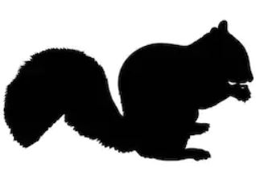
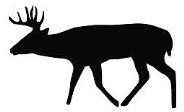

### A repository for:

Fidino, M., Barnas, G.R., Lehrer, E.W., Murray, M., and Magle, S.B. (in prep). A trifold approach to quantify the effect of a common olfactory lure on the detection probability of mammals captured on camera traps

 <h3>Scripts</h3> 

---

**This repository has 3 R Scripts used for the 3 seperate analyses. They will be in your working directory. These include:**

**fit_binomial_model.R:** This script reads in the detection / non-detection data of the species we could analyze and fits the binomal observation model to the data.

**fit_exponential_model.R:** This script reads in the time to first detection data of the species we could analyze and fits the exponential observaiton model to the data.

**fit_poisson_model.R:** This script reads in the number of images taken of the species we could analyze and fits the Poisson model to these data.

---

 <h3>Models</h3> 

---

**This repository has 3 JAGS models that we used for our analysis. They should be placed within the jags_models sub-folder of the working directory. These include:**

**lure_occ_model.R:** The binomial detection model.

**time_to_event.R:** The exponential detection model.

**lure_occ_poisson.R:** the Poisson detection model.

---

 <h3>Data</h3> 

---

**There are 2 data files within the `data` sub-folder which are used in this analysis. They include:**

**lure_position.csv:** This csv has 5 columns and 40 rows (excluding the header) and contains information on whether a lure was placed in view of a given camera.

| Column header | Data type | Description |
|---|---|---|
| `site`| Character | The site abbreviation. Sampling units are split apart by cameras A and B. |
| `week_1` | Numeric | Whether lure was present or not during the first week. 1 = lure, 0 = no lure control. |
| `week_2` | Numeric | Whether lure was present or not during the second week. 1 = lure, 0 = no lure control. |
| `week_3` | Numeric | Whether lure was present or not during the third week. 1 = lure, 0 = no lure control. |
| `week_4` | Numeric | Whether lure was present or not during the fourth week. 1 = lure, 0 = no lure control. |

 
 

**precip.csv:** This csv has 4 columns and 40 rows (excluding the header) and contains information on the number of inches of rain that occured over a given week of sampling. This csv is ordered identically to `lure_position.csv`

| Column header | Data type | Description |
|---|---|---|
| `week_1` | Numeric | Inches of rain on week 1 |
| `week_2` | Numeric | Inches of rain on week 2 |
| `week_3` | Numeric | Inches of rain on week 3 |
| `week_4` | Numeric | Inches of rain on week 4 |

 

 
 
 
 
 
 <h3>Detection data</h3> 

 
**There are 3 folders within the `data` sub-folder that contain they species detection data for each analysis. They include:**

**/data/detection_history:** This contains 8 csv files, all of which are formatted identically. They are titled after each of the 8 species analyzed in the binomial model. The format of these files are

| Column header | Data type | Description |
|---|---|---|
| `site`| Character | The site abbreviation. Sampling units are split apart by cameras A and B.` |
| `day_1` | Numeric | Whether a the species in the csv was detected on this day. Detection = 1, non-detection = 0, sampling did not occur = NA|
| ... | ... |Additional columns of detection data |
| `day_28` | Numeric | Whether a the species in the csv was detected on this day. Detection = 1, non-detection = 0, sampling did not occur = NA |

 
 

**/data/time_to_detection:** This contains 8 csv files, all of which are formatted identically. They are titled after each of the 8 species analyzed in the exponential model. These files do not contain site information but are ordered identically to `lure_position.csv`. The format of these files are

| Column header | Data type | Description |
|---|---|---|
| `week_1` | Numeric | The number of continous days to first detection at a site on week 1. Non-detection = `NA`|
| `week_2` | Numeric | The number of continous days to first detection at a site on week 2. Non-detection = `NA` |
| `week_3` | Numeric | The number of continous days to first detection at a site on week 3. Non-detection = `NA` |
| `week_4` | Numeric | The number of continous days to first detection at a site on week 4. Non-detection = `NA` |

 
 

**/data/number_of_photos:** This contains 8 csv files, all of which are formatted identically. They are titled after each of the 8 species analyzed in the Poisson model. These files do not contain site information but are ordered identically to `lure_position.csv`. The format of these files are

| Column header | Data type | Description |
|---|---|---|
| `week_1` | Numeric | The number of photos collected of a species at a site on week 1 |
| `week_2` | Numeric | The number of photos collected of a species at a site on week 2 |
| `week_3` | Numeric | The number of photos collected of a species at a site on week 3 |
| `week_4` | Numeric | The number of photos collected of a species at a site on week 4 |

 
 

 

 
